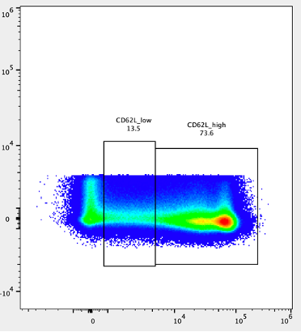
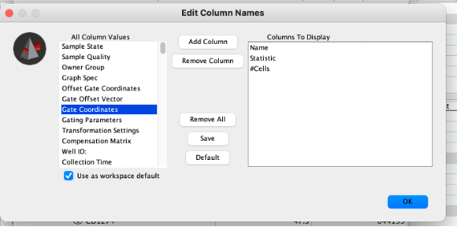
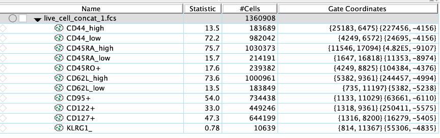
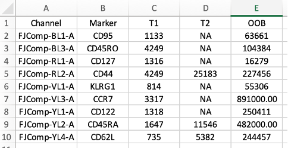

# Preparing fcs data in Flowjo

-   Import the fcs files

-   Use the normal gating strategy to clean up the samples of doublets, debris, dead cells, etc.

-   Add keyword annotation:

    -   One Keyword needs to be named "Sample_ID". This should be a unique integer value for each sample

-   Concatenate the fcs files for the population of interest (e.g. Live cells)

    -   If any samples have low viability or low number of cells, consider omitting them from the concatenated file.

    -   Select all the compensated fluorescence parameters of interest.

        -   To keep the fcs file size to a minimum, only use the "area" parameters.
        -   We suggest also including FSC-A, SSC-A and any other parameters that may assist with gating of marker positive populations.

    -   Add "Sample_ID" and any other keywords in the "Additional Parameters" section. Be sure to uncheck "Spread distribution of keyword data"

-   Load the concatenated fcs file into a new FlowJo workspace and create gates for each parameter. (Figure 1). These gates should be the rectangular gate, with the upper bound set to exclude any potential outlier events ("Out of Bounds").

    -   

    -   You can include more than one positive gate if the marker has more than one positive state (e.g. low and high).

    -   To get the fluorescence intensity thresholds for the gates, right click the column names area in the workspace window and add the "Gate Coordinates" column (Figure 2).

    -   

    -   The coordinate values are in (x,y) pairs. You will want the first x value as the lower bound for positivity. The second x value will serve as the "Out of Bounds" threshold if the marker only has one positivity state. If it has more than one positivity state, the second x value of highest state will be the "Out of Bounds" threshold (Figure 3).

    -   

    -   To record the fluorescence intensity thresholds, create a csv file with the following columns and corresponding information:

        -   Channel: This will include the name of the channel associated with the marker (e.g. FJComp-BL1-A). This must match exactly the fcs file column name. We suggest double-checking that these match in R when running PhenoComb. (Figure 4).

        -   

        -   Marker: This is the marker name that corresponds to the channel (e.g. CD3).

        -   T1: This is the lower fluorescence intensity threshold for positivity on a marker.

        -   (Optional) T2: Only include if any markers have more than one positivity state (i.e. low and high).

        -   (Optional) T3: Only include if any markers have more than two positivity states (i.e. low, mid, high).

        -   OOB: This is the upper bound of fluorescence intensity. Anything above this will be filtered out as noise.

    -   Create another csv file. This one will contain the sample information. There should be one column with the Sample_ID that corresponds to the Sample_ID from FlowJo. Other columns should include any additional information about the samples (e.g. timepoint, patient_id, response, survival, survival_censor) needed for comparisons.
